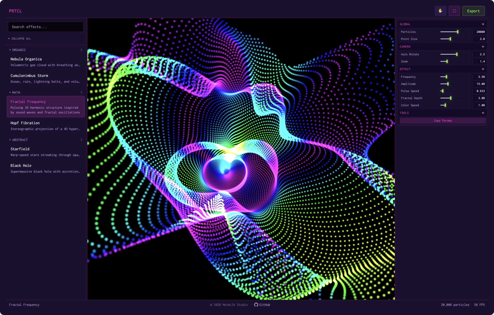

# PRTCL

[](https://react.dev/)
[](https://threejs.org/)
[](https://www.typescriptlang.org/)
[](https://ai.google.dev/edge/mediapipe/solutions/vision/hand_landmarker)
[](./LICENSE)

GPU-accelerated particle effects you can drop into any website. Pick a preset, twist a few sliders, copy the snippet. Elementor, Webflow, Next.js, React, plain HTML — it doesn't care. Your friends will think you understand 4D stereographic projections. You don't. Neither do I. But the particles don't know that, and they look incredible anyway.

<div align="center">



</div>

21 built-in effects across 4 categories. Real-time sliders. Bloom post-processing. Volumetric raymarching. Fluid holographic shaders. Smooth morph transitions. Hand tracking via webcam. Audio reactivity. Adaptive quality so your GPU doesn't cry. Zero accounts, zero backend.

**[prtcl.es](https://prtcl.es)**

---

## Quick Start

```bash
git clone https://github.com/enuzzo/prtcl.git
cd prtcl && npm install
npm run dev
```

Open [localhost:5173](http://localhost:5173). That's it.

```bash
npm run build        # Production build
npm run preview      # Preview build
npx vitest run       # Tests
npx tsc -b           # Type check
```

---

## How It Works

Effects are JS function bodies compiled at runtime via `new Function()`. Each one gets a particle index, a Vector3 target, a Color, elapsed time, and an `addControl()` function for declaring sliders. User code is sandboxed through static analysis, dry runs, and NaN guards before it touches the GPU.

The render loop pre-allocates everything and reads state via Zustand's `getState()` — zero React re-renders at 60fps. Adaptive quality scales between 5k–30k particles automatically.

**Bloom** is engine-level via `@react-three/postprocessing` — effects opt in with `bloom: true`. ACES tone mapping when active. Disabled on mobile. Zero overhead when off.

**Custom renderers** let effects break free from the particle system entirely. Inside Nebula uses volumetric raymarching on a BackSide BoxGeometry. Iridescence wraps a fluid holographic domain-warping shader on a SphereGeometry with Fresnel shading. The Spirit is preserved as an isolated legacy Three.js renderer so Edan Kwan's original MIT-licensed piece keeps its temperament intact. All three run outside the standard particle path.

Hand tracking uses MediaPipe Hands WASM (~4MB, lazy-loaded). Open palm controls camera orbit and zoom. Disturb mode lets your hand pass through the particle cloud. All inputs smoothed. It works better than it has any right to.

---

## Effects

| Category | Effects |
|---|---|
| **Math** | Fractal Frequency, Hopf Fibration, 4D Clifford Torus, Electromagnetic Field, Perlin Noise, Hyperflower |
| **Organic** | Nebula Organica, Inside Nebula, Cumulonimbus Storm, Fireflies, Murmuration |
| **Text** | Text Wave, Text Scatter, Text Dissolve, Text Terrain |
| **Abstract** | Starfield, Black Hole, Axiom, Paper Fleet, Iridescence, The Spirit |

---

## Credits

Inspired by [particles.casberry.in](https://particles.casberry.in/) by [CasberryIndia](https://github.com/CasberryIndia). Several presets adapted from community contributions.

| Effect | Credit | License |
|---|---|---|
| Hopf Fibration, Black Hole, Cumulonimbus Storm, 4D Clifford Torus | [CasberryIndia](https://github.com/CasberryIndia) | MIT |
| Fractal Frequency | Gabi | MIT |
| Inside Nebula | [Sabo Sugi](https://codepen.io/sabosugi/pen/ZYprEOw) — volumetric raymarching nebula | MIT |
| Iridescence | [Sabo Sugi](https://codepen.io/sabosugi/pen/zxKELBB) — fluid holographic shader | MIT |
| The Spirit | Edan Kwan — original MIT-licensed effect, adapted here through an isolated legacy renderer with author credit retained | MIT |
| Perlin Noise | [Victor Vergara](https://codepen.io/vcomics/pen/djqNrm) — GLSL Perlin displacement, Perlin noise by [Stefan Gustavson](https://github.com/ashima/webgl-noise) | MIT |
| All other effects | PRTCL Team | MIT |

Built with [React Three Fiber](https://github.com/pmndrs/react-three-fiber), [drei](https://github.com/pmndrs/drei), [postprocessing](https://github.com/pmndrs/postprocessing), [Tweakpane](https://tweakpane.github.io/docs/), [MediaPipe Hands](https://ai.google.dev/edge/mediapipe/solutions/vision/hand_landmarker), and the [vibemilk](https://github.com/enuzzo/vibemilk) acid-pop theme.

---

## License

[MIT](./LICENSE) — © 2026 [Netmilk Studio](https://netmilk.studio). Use it, fork it, embed it in your client's Webflow site and charge them for it.

---

<div align="center">

*Built with too many lerp alpha constants and the unwavering belief that raymarching*
*a volumetric nebula inside a particle editor is a perfectly reasonable thing to ship.*

</div>
